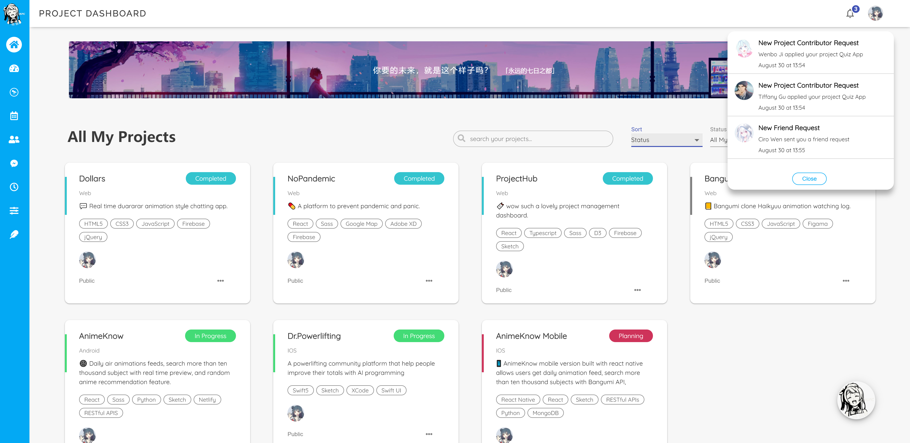
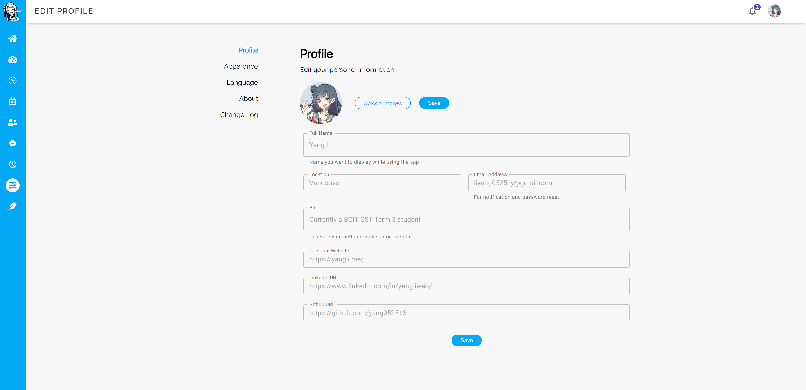
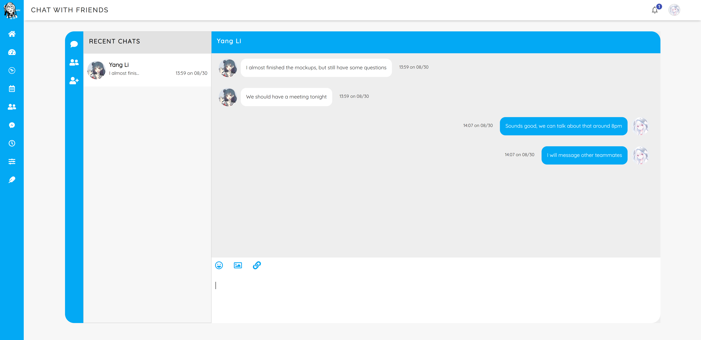
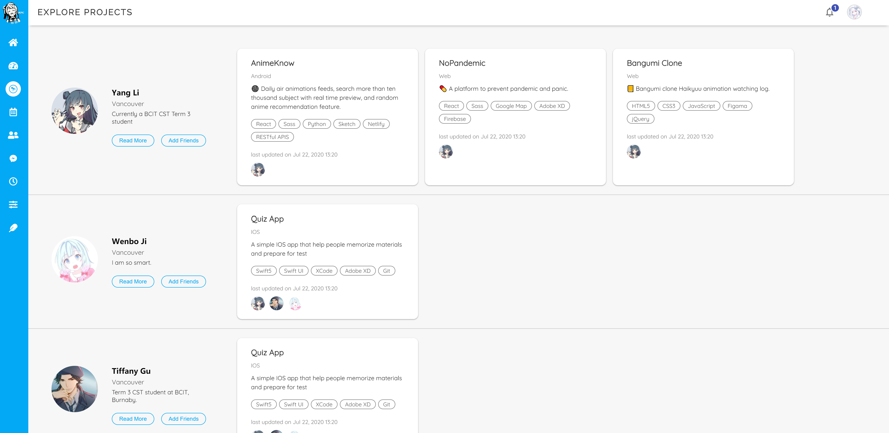
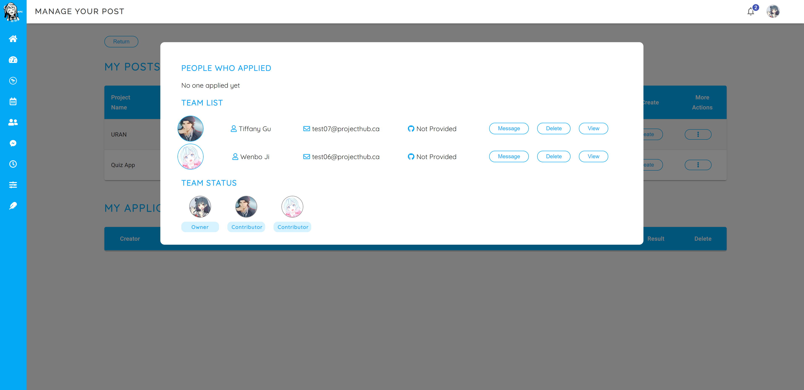

<p align="center">

</p>

<p align="center">

</p>

<h1 align="center">ProjectHub</h1>

> 🔖 A collection based project management dashboard application.



## Introduction

ProjectHub is a project management system that utilized with different progress status and conventional kanban system to track all your projects.

Projecthub also allows you to create team project request and let other developers to join with you.

---

## Usage

### Live Demo

Please checkout live demo at here [Projecthub](https://projecthub-yang.web.app/)

### Running on Local Machine

> The application use firebase database, plase replace **your own firebase database configuration** in `.env` and change accordingly in `Login.tsx` components under `auth` src folder.

Then you could running on the local machine using `start script command`.

```shell
git clone https://github.com/yang052513/projecthub.git
cd projecthub
npm install
npm start
```

## Features

- Creating or editing a project and manage different status
- Team shared or individual used Kanban system
- Working with other people by creating a group project request
- Notification centre
- Project and activity analysis with chart view
- Explore other people public project ideas
- Friend and chat system
- Story share feature
- Custom the apparence of the application

**Setting, Apparence, Profile**



**Friend chat**



**Explore**



**Group**



## Tools

- React
- React Hooks API
- Typescript
- Sass
- Firebase
- Material UI
- Rechart
